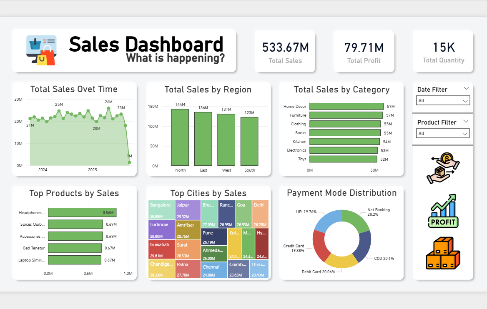
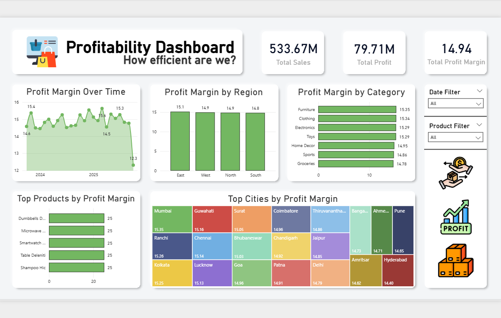
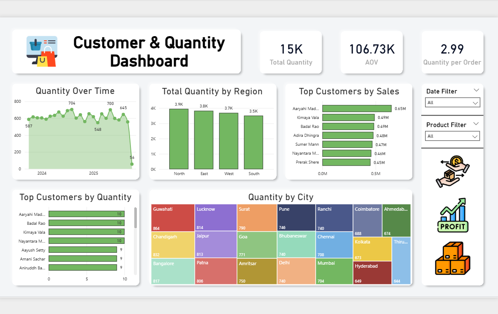

# E-Commerce Sales & Profitability Dashboard

## 📝 Project Overview

This project presents a comprehensive analysis of a fictional e-commerce store's sales data in India from October 2023 to October 2025. The goal was to move beyond simple sales tracking to uncover deeper insights into profitability and customer behavior, ultimately providing actionable recommendations for business growth.

---

## 🚀 Dashboards

The analysis is segmented into three dedicated dashboards, each answering a key business question:

### 1. Sales Dashboard - "What is happening?"
This dashboard provides a high-level overview of the overall sales performance, focusing on key metrics like total revenue, regional performance, and top-selling product categories.

### 2. Profitability Dashboard - "How efficient are we?"
Here, the focus shifts from revenue to efficiency. This dashboard analyzes **Profit Margin** to identify the most profitable regions, product categories, and cities, offering a clearer view of business health.

### 3. Customer & Quantity Dashboard - "Who are our customers?"
This dashboard dives into customer purchasing patterns. It introduces metrics like **Average Order Value (AOV)** and **Quantity per Order** to identify high-value customers and understand buying habits.

---

## 💡 Key Insights & Recommendations

* **Insight 1: High Sales vs. High Profitability**
    * **Finding:** The 'Home Decor' category drives the highest sales (57M), but the 'Furniture' category boasts a superior profit margin (15%).
    * **Recommendation:** Launch targeted marketing campaigns for the 'Furniture' category to increase its sales volume, capitalizing on its high profitability to significantly boost overall profit.

* **Insight 2: Geographic Profit Pockets**
    * **Finding:** Mumbai, while not a top-5 city by sales, has the highest profit margin (15.35%).
    * **Recommendation:** Investigate the operational factors in Mumbai (e.g., product mix, logistics, local pricing) and replicate successful strategies in lower-margin cities like Hyderabad.

* **Insight 3: Identifying High-Value Customers**
    * **Finding:** The top customers by sales volume are also the ones who purchase the highest quantity of items.
    * **Recommendation:** Develop a customer loyalty program to retain these high-value customers and encourage repeat purchases through exclusive offers.

---

## 🛠️ Tools Used

* **Data Analysis:** Power BI / DAX
* **Data Visualization:** Power BI
* **Design:** Figma (for the background elements)

---

## 📁 Project Files

* **Power BI** `E-Commerce Dashboard.pbix`
* **Dataset:** `ecommerce_data.csv`

Feel free to download the source file to explore the interactive dashboard and the data model.
